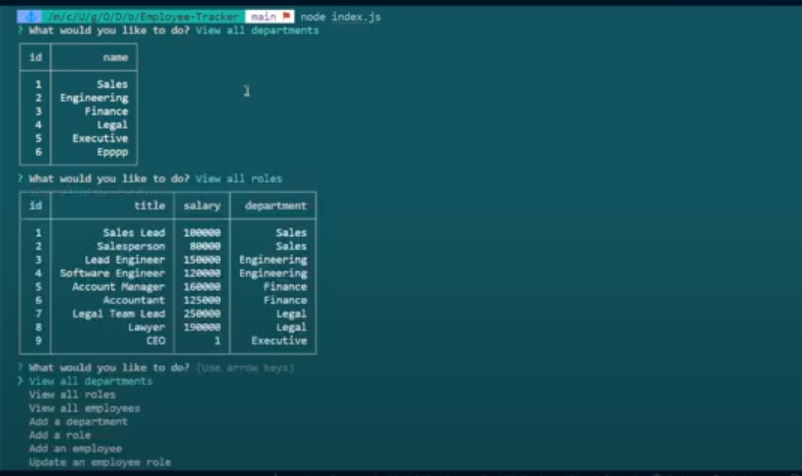

# < Employee Tracker >

## Description

Given a command-line application that accepts user input
When I start the application
Then I am presented with the following options: view all departments, view all roles, view all employees, add a department, add a role, add an employee, and update an employee role
When I choose to view all departments
Then I am presented with a formatted table showing department names and department ids
When I choose to view all roles
Then I am presented with the job title, role id, the department that role belongs to, and the salary for that role
When I choose to view all employees
Then I am presented with a formatted table showing employee data, including employee ids, first names, last names, job titles, departments, salaries, and managers that the employees report to
When I choose to add a department
Then I am prompted to enter the name of the department and that department is added to the database
When I choose to add a role
Then I am prompted to enter the name, salary, and department for the role and that role is added to the database
When I choose to add an employee
Then I am prompted to enter the employee’s first name, last name, role, and manager, and that employee is added to the database
When I choose to update an employee role
Then I am prompted to select an employee to update and their new role and this information is updated in the database

## Table of Contents

- [Installation](#installation)
- [Usage](#usage)
- [Credits](#credits)
- [License](#license)
- [Features](#features)
- [How to Contribute](#how-to-contribute)
- [Tests](#tests)

## Installation

N/A

## Usage

Here is a walkthrough video link: https://drive.google.com/file/d/1F5p3GFxEUwkndw0yG5u0aM1HKL7brK_c/view 

## Credits

Giselle Reyes, and the instructor in the UM Web Development course for providing the starter code for the challenge.

## License

## Features

CMS to manage employee database

## How to Contribute

Personal challenge

## Tests

Used VS Code